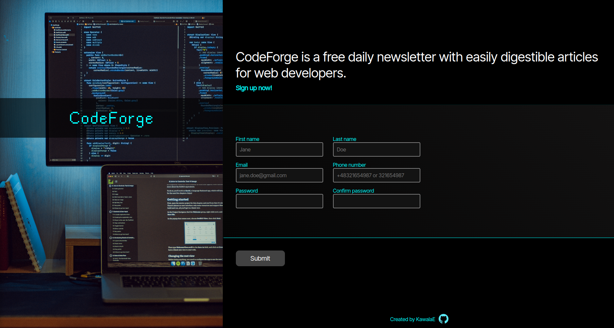
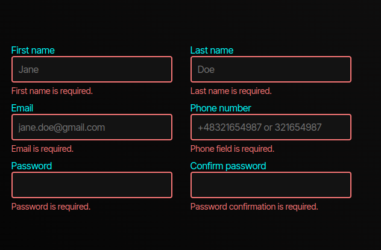
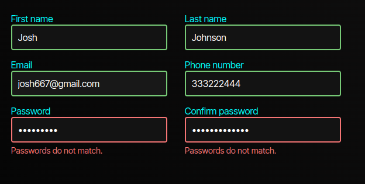
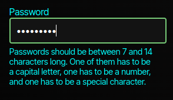
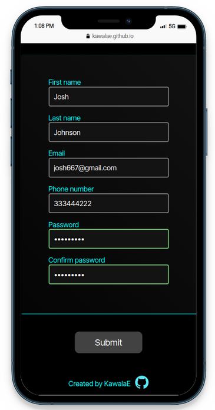

# Sign-Up-Form
<h1>Newsletter sign up form project<h1>

The goal of this project is to practice building <strong>form validation in Java Script</strong> and to become acquainted with creating <strong>responsive design.</strong>

<h2>Technologies used: <h2>

<h2>Project description</h2>
The project can be viewed at the following URL:
https://kawalae.github.io/Sign-Up-Form/

Form validation was written entirely in Java Script. If the Submit button is pressed but no needed data is entered, the input fields will be highlighted and an appropriate message will show beneath it.

   

If the password and password confirmation do not match, the user will be notified.

    

If the password field becomes active, there will be message displayed about password requirements. While enetering password the ouline of an input will higlight red if the requirement are not yet met or geen if password meets the requirements. 

    

The form was created with mobile users in mind. 

    

        
    

    

        
    

<h2>Acknowledgements:</h2>
<ul>
    <li><a target="_blank" href="https://icons8.com/icon/21278/css3">CSS3</a> icon by <a target="_blank" href="https://icons8.com">Icons8</a></li>
    <li><a target="_blank" href="https://icons8.com/icon/PXTY4q2Sq2lG/javascript">JavaScript</a> icon by <a target="_blank" href="https://icons8.com">Icons8</a></li>
    <li><a target="_blank" href="https://icons8.com/icon/v8RpPQUwv0N8/html-5">Html 5</a> icon by <a target="_blank" href="https://icons8.com">Icons8</a></li>
    <li>Photo by <a href="https://unsplash.com/@safarslife?utm_source=unsplash&utm_medium=referral&utm_content=creditCopyText">Safar Safarov</a> on <a href="https://unsplash.com/photos/koOdUvfGr4c?utm_source=unsplash&utm_medium=referral&utm_content=creditCopyText">Unsplash</a>
  </li>
</ul>

